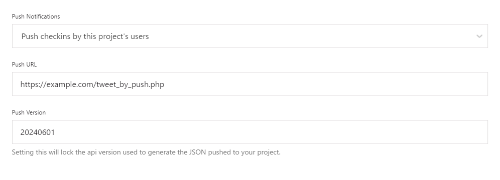

[English](README.md) | [日本語](README.ja.md)

# Swarm Linker

SwarmでのチェックインをSNS(X/Twitter)に投稿するアプリケーション。

## 概要

Swarmでのチェックイン時にWebhookを受け取り、X/Twitterに投稿します。  
投稿されるテキストは以下の通りです。なお、コメントや画像は投稿されません。

```
I'm at [場所名] in [住所]
[共有URL]
```

## 内容

- [authorization.php](authorization.php) - アクセストークンを取得するための認可(認証)を開始します。
- [access_token.php](access_token.php) - 認証後にFoursquareからリダイレクトされ、アクセストークンを取得します。
- [tweet_by_push.php](tweet_by_push.php) - Swarmでのチェックイン時にWebhookを受け取り、X/Twitterに投稿します。

## 依存環境

- PHP >= 8.0
- [vlucas/phpdotenv](https://github.com/vlucas/phpdotenv)
- [abraham/twitteroauth](https://github.com/abraham/twitteroauth)
  - ext-curl
  - ext-openssl

## 使い方

### 1. 依存関係のインストール

[Composer](https://getcomposer.org/)をダウンロードし、インストールします。
その後、以下のコマンドを実行し、依存関係をインストールします。

```sh
$ composer install
```

### 2. `.env` ファイルの設定

`.env.example` ファイルを参考に `.env` ファイルを作成し、環境に合わせて設定します。

> [!IMPORTANT]
> `.env` ファイルには機密情報を含めるため、必ず外部から見えないようにしてください。

#### Foursquare関係の設定

Foursquare APIのバージョンを設定します。特に理由がない場合、デフォルトのままとしてください。

```env
FOURSQUARE_API_VERSION="20240601"
```

[Foursquare Developer Console](https://location.foursquare.com/developer/)から以下の認証情報を取得し、設定します。

```env
FOURSQUARE_API_KEY=""
FOURSQUARE_API_KEY_SECRET=""
FOURSQUARE_PUSH_SECRET=""
```

`access_token.php` ファイルにアクセスするURLを設定します。

```env
FOURSQUARE_REDIRECT_URI="https://example.com/access_token.php"
```

Foursquareのアクセストークンは後で設定します。

```env
FOURSQUARE_ACCESS_TOKEN=""
```

#### X/Twitter関係の設定

[X/Twitter Developer Portal](https://developer.twitter.com/en/portal/petition/essential/basic-info)から以下の認証情報を取得し、設定します。

```env
TWITTER_API_KEY=""
TWITTER_API_KEY_SECRET=""
TWITTER_ACCESS_TOKEN=""
TWITTER_ACCESS_TOKEN_SECRET=""
```

### 3. Foursquare Developer Consoleの設定

[Foursquare Developer Console](https://location.foursquare.com/developer/)にアクセスし、以下を設定します。

#### OAuth Authenticationの設定

- `Redirect URL` - `access_token.php` ファイルにアクセスするURLを設定します。


#### Push APIの設定

- `Push Notifications` - `Push checkins by this project's users` を選択します。
- `Push URL` - `tweet_by_push.php` ファイルにアクセスするURLを設定します。
- `Push Version` - Push APIのバージョンを設定します。特に理由がない場合、`20240601` に設定してください。



### 4. Foursquareとの認証

ブラウザから `authorization.php` ファイルにアクセスし、Foursquareと認証します。  
認証後、ブラウザに表示されたアクセストークンを `.env` ファイルに追記します。

```env
FOURSQUARE_ACCESS_TOKEN=""
```

以上の設定により、Swarmでのチェックイン時に `tweet_by_push.php` ファイルがアクセスされ、X/Twitterに投稿されるようになります。

## ライセンス

このソフトウェアは[Unlicense](LICENSE)に基づいてライセンスされています。

## 関連項目

- https://appl-rot13.hatenablog.jp/entry/2024/07/02/000417
