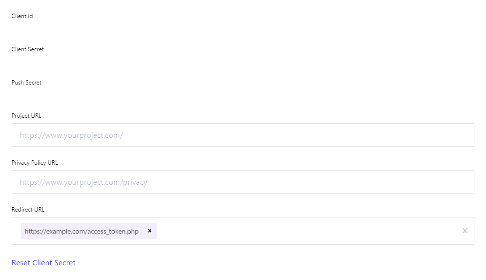
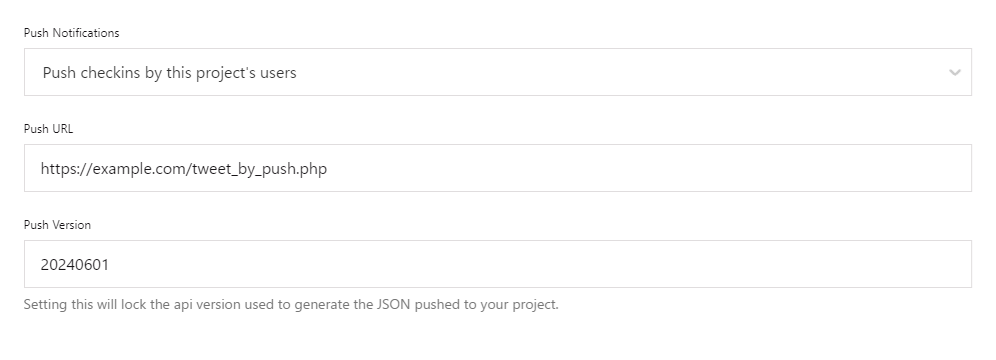

[English](README.md) | [日本語](README.ja.md)

# Swarm Linker

An application that posts check-ins on Swarm to social media(X/Twitter).

## Overview

At check-in on Swarm, receives a webhook and then posts to X/Twitter.  
The posted text will be as follows. Note that attached comments and images will not be included in the post.

```
I'm at [Venue name] in [City], [State]
[Share URL]
```

## Contents

- [authorization.php](authorization.php) - Initiates authorization to obtain the access token.
- [access_token.php](access_token.php) - After authentication, redirected from Foursquare to obtain the access token.
- [tweet_by_push.php](tweet_by_push.php) - At check-in on Swarm, receives a webhook and then posts to X/Twitter.

## Requirements

- PHP >= 8.0
- [vlucas/phpdotenv](https://github.com/vlucas/phpdotenv)
- [abraham/twitteroauth](https://github.com/abraham/twitteroauth)
  - ext-curl
  - ext-openssl

## Usage

### 1. Install Dependencies

Download and install [Composer](https://getcomposer.org/).
Then, run the following command to install the dependencies.

```sh
$ composer install
```

### 2. Setting Up `.env` File

Create a `.env` file based on the `.env.example` file and set it up to match your environment.

> [!IMPORTANT]
> Ensure that the `.env` file is protected from external visibility as it contains confidential information.

#### Foursquare Settings

Set the Foursquare API version. If there is no reason, leave it as the default.

```env
FOURSQUARE_API_VERSION="20240601"
```

Obtain and set the following credentials from [Foursquare Developer Console](https://location.foursquare.com/developer/).

```env
FOURSQUARE_API_KEY=""
FOURSQUARE_API_KEY_SECRET=""
FOURSQUARE_PUSH_SECRET=""
```

Set the URL to access the `access_token.php` file.

```env
FOURSQUARE_REDIRECT_URI="https://example.com/access_token.php"
```

The Foursquare access token will be set later.

```env
FOURSQUARE_ACCESS_TOKEN=""
```

#### X/Twitter Settings

Obtain and set the following credentials from [X/Twitter Developer Portal](https://developer.twitter.com/en/portal/petition/essential/basic-info).

```env
TWITTER_API_KEY=""
TWITTER_API_KEY_SECRET=""
TWITTER_ACCESS_TOKEN=""
TWITTER_ACCESS_TOKEN_SECRET=""
```

### 3. Configuring Foursquare Developer Console

Access [Foursquare Developer Console](https://location.foursquare.com/developer/) and configure the following.

#### OAuth Authentication Settings

- `Redirect URL` - Set the URL to access the `access_token.php` file.



#### Push API Settings

- `Push Notifications` - Select `Push checkins by this project's users`.
- `Push URL` - Set the URL to access the `tweet_by_push.php` file.
- `Push Version` - Set the push API version. If there is no reason, set it to `20240601`.



### 4. Authenticate with Foursquare

Access the `authorization.php` file through your web browser and authenticate with Foursquare.  
After authentication, append the access token displayed in the web browser to the `.env` file.

```env
FOURSQUARE_ACCESS_TOKEN=""
```

Due to the above settings, at check-in on Swarm, the `tweet_by_push.php` file will be accessed and then posted to X/Twitter.

## License

This software is licensed under the [Unlicense](LICENSE).
